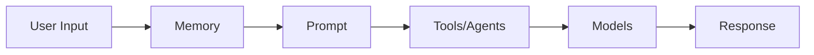

# Introduction to LangChain
In this chapter, you'll learn what LangChain is, why it exists, explore its core concepts like models, prompts, and tools, and make your first LLM call using DeepSeek Models. By the end, you'll understand how LangChain provides a consistent interface across different AI providers, making it easy to switch between them with just environment variables.


## Introduction: The Hardware Store Analog
Imagine you're building a house. You could manufacture your own bricks, create cement from scratch, and forge your own tools. Or, you could use a hardware store that provides quality materials and proven tools.

LangChain is the hardware store for AI development. Just like a hardware store provides:
- **Ready-to-use Tools**: so you don't build tools from scratch.
- **Universal adapters**: so you can switch between brands.
- **Blueprints**: so you follow proven designs.
- **Interchangeable parts**: so you can mix and match.

LangChain provides:
- **Ready-to-use Components** (prompts, memory, tools): so you don't build everything from scratch.
- **Chat and LLM Abstractions** (one interface for OpenAI, Azure, Anthropic): so you can switch LLMs easily.
- **Patterns** (agents, RAG, chatbots): so you follow proven AI application designs.
- **Composability** (components that work together seamlessly): mix and match databases, vector stores and more in your projects.


## What is LangChain?
LangChain is a framework for building AI-powered applications using Large Language Models (LLMs).

### The Problem It Solves
Without LangChain, you'd need to:
- Write different code for each LLM provider;
- Build your own prompt management system;
- Create custom tools and function calling logic;
- Implement memory and conversation handling from scratch;
- Build agent systems without any structure;

### The LangChain Solution
With LangChain, you get:
- **Provider abstraction**: Switch between OpenAI, Azure, Anthropic with minimal code changes;
- **Prompt templates**: Reusable, testable prompts;
- **Tools**: Extend AI with custom functions and APIs;
- **Memory**: Built-in conversation history;
- **Agents**: Decision-making AI that can use tools;


## Core Concepts Overview
LangChain is built around 5 core concepts you'll learn through this course:
1. **Models**: AI brains that process inputs and generate outputs. Learn in this chapter.
2. **Prompts**: How you communicate with AI models using reusable templates. 
3. **Tools**: Extend AI capabilities with external functions and APIs.
4. **Agents**: AI systems that reason and decide which tools to use autonomously.
5. **Memory**: Remember context across interactions.

### How these Concepts work together




## How to Get Started
1. Clone the repository:
```bash
git clone https://github.com/wenyuliuinfo/langchain_for_beginners.git
cd langchain_for_beginners/
```

2. Install the prerequisites:
```bash
python3 -m venv .venv
source .venv/bin/activate
pip install -U -r requirements.txt
```

3. Run the application:
```bash
cd 01-introduction/python
python 01_hello_world.py
```

